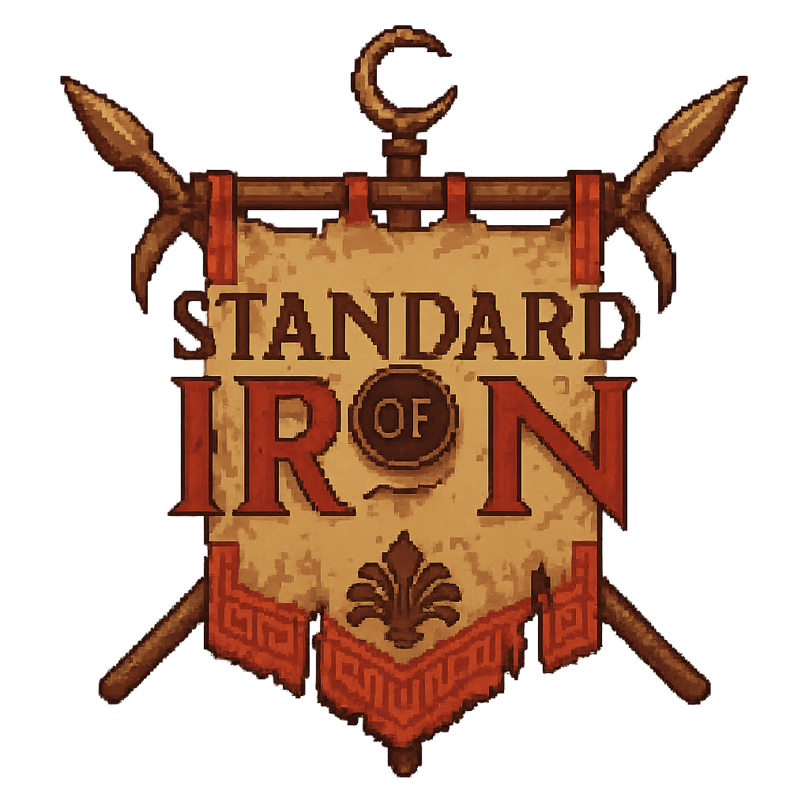
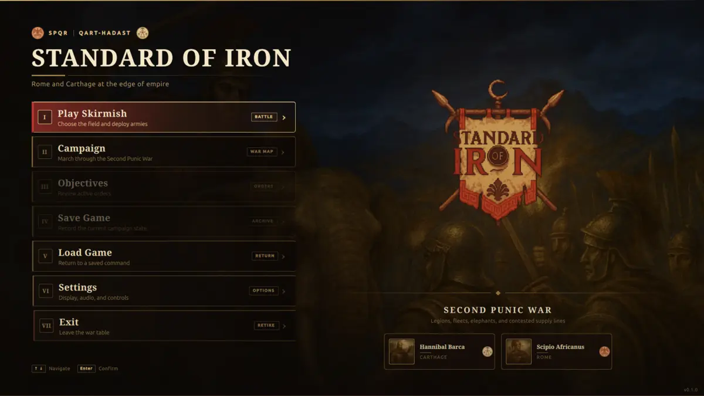
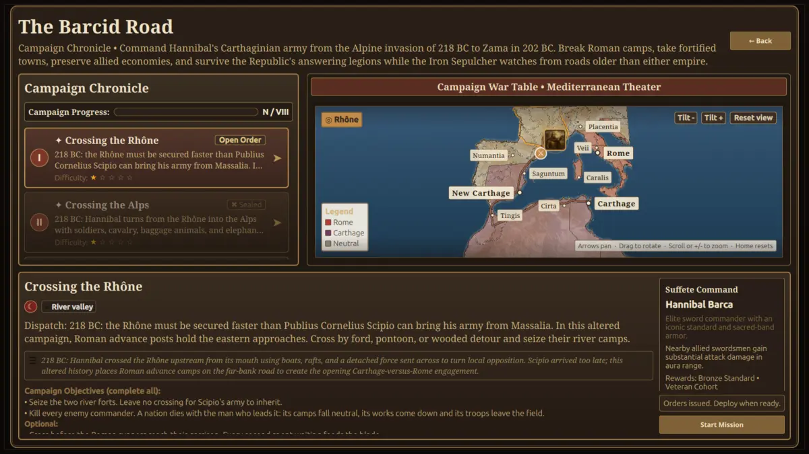

<p align="center">
  
</p>

<h1 align="center">Standard of Iron</h1>

<p align="center">
  <strong>A large-scale strategy game of formations, command, and survival during the Second Punic War.</strong>
</p>

<p align="center">
  <a href="https://github.com/djeada/Standard-of-Iron/releases"></a>
  <a href="https://github.com/djeada/Standard-of-Iron/actions/workflows/pr.yml"></a>
  <a href="LICENSE"></a>
  
  
</p>

<p align="center">
  <a href="#download">Download</a> ·
  <a href="#gameplay">Gameplay</a> ·
  <a href="#building-from-source">Build</a> ·
  <a href="#architecture">Architecture</a> ·
  <a href="CONTRIBUTING.md">Contribute</a>
</p>

Standard of Iron is an open-source, single-player real-time strategy game in
which Rome and Carthage fight across an altered Second Punic War. Command whole
formations from above, take direct control of a battlefield commander, build
and defend supply lines, and carry Hannibal's army from the Rhône to Zama while
the supernatural Iron Sepulcher gathers strength around the conflict.

The game is written in C++20 with Qt 6 and a custom tiered OpenGL renderer. Its
simulation kernel runs independently of the renderer, making the same gameplay
systems available to the live game, headless tests, balance simulation, and
developer tools.

> [!NOTE]
> Version 0.1.0 is the first public, pre-1.0 release. The game is actively
> developed; save, mission, and map formats may change between 0.x releases.



## At a glance

|              | Current scope                                                                                        |
| ------------ | ---------------------------------------------------------------------------------------------------- |
| Campaign     | **The Barcid Road**, eight missions from the Rhône crossing to Zama                                  |
| Tutorial     | **Field Training**, a guided first battle that teaches orders, economy, building, armies and defence |
| Battlefields | 13 campaign and skirmish maps with rivers, mountains, forests, settlements, walls, and siege lanes   |
| Factions     | Rome and Carthage are playable; the Iron Sepulcher appears as a campaign enemy                       |
| Command      | Top-down RTS control and direct commander combat in the same battle                                  |
| Forces       | Infantry, archers, cavalry, healers, builders, commanders, siege engines, and war elephants          |
| Formations   | Three nation doctrines and 29 authored unit layouts, including shield walls and cavalry wedges       |
| Languages    | English, German, Spanish, Brazilian Portuguese, and Arabic with right-to-left layout                 |
| Platforms    | Linux, macOS, and Windows                                                                            |

## Gameplay

### Fight at army scale

- Select individual troops or entire groups, then move, attack, patrol, guard,
  hold, or run them through one command pipeline shared with the AI.
- Deploy formations built from nation doctrine, troop role, terrain, and
  battlefield intent rather than fixed decorative ranks.
- Combine infantry, ranged troops, cavalry, elephants, catapults, ballistae,
  healers, and commander auras against field armies and fortified positions.
- Assault walls, gates, towers, and capturable structures while projectiles,
  fire, morale effects, and melee contact reshape the fight.

### Lead from the front

Switch between the strategic camera and direct commander control during a
battle. Commanders have distinct weapons, auras, authored melee actions, guard
and dodge mechanics, lock-on, abilities, and ranged combat where their loadout
supports it. Army orders remain active while the player fights on the ground.

### Run an army, not just a battle line

- Gather timber, stone, iron, and gold; haul resources to a stockpile before
  they become spendable.
- Recruit troops, set rally points, construct and repair buildings, raise walls
  and gates, and trade through marketplaces.
- Defend settlements whose workers, civilians, livestock, wildlife, and weather
  continue to act around the battle.
- Save and resume matches through versioned snapshots with per-slot previews,
  campaign progress, quick-save, and quick-load support.

### March the Barcid Road

The campaign follows Hannibal's Carthaginian army through eight missions: the
Rhône, the Alps, Ticino, Trebia, Trasimene, Cannae, Campania, and Zama. Missions
mix capture, survival, economy, timed, wave, and commander-elimination goals.
Their maps, rosters, objectives, pressure schedules, and rewards are all
data-driven.



The detailed roster and design intent for every mission live in
[docs/CAMPAIGN_MISSIONS.md](docs/CAMPAIGN_MISSIONS.md).

### Designed for different players

- Every gameplay command is rebindable, with conflict detection per control
  context.
- Interface scaling, camera-motion reduction, edge-scroll controls,
  colour-vision-safe team palettes, and patterned selection rings are built in.
- The interface is fully localized in five languages; Arabic changes the whole
  layout to right-to-left.
- Spatial audio, faction voices, battlefield ambience, weather beds, and
  refusal/confirmation cues provide information beyond the visual layer.

See [docs/ACCESSIBILITY.md](docs/ACCESSIBILITY.md) for the full accessibility
contract.

## Download

Packages for tagged versions are published on the
[GitHub Releases page](https://github.com/djeada/Standard-of-Iron/releases).
Each release package is accompanied by a `.sha256` checksum and passes a
packaged-game renderer self-test before publication.

| Platform | Package                                            | Launch                                                                 |
| -------- | -------------------------------------------------- | ---------------------------------------------------------------------- |
| Linux    | `standard_of_iron-<version>-linux-x86_64.AppImage` | Mark it executable and run it; no installation or root access required |
| macOS    | `standard_of_iron-<version>-macos-universal.dmg`   | Open the image and drag the application to `Applications`              |
| Windows  | `standard_of_iron-<version>-win-x64.zip`           | Extract the archive and run `standard_of_iron.exe`                     |

Verify a downloaded package on Linux with:

```bash
sha256sum --check standard_of_iron-0.1.0-linux-x86_64.AppImage.sha256
```

The macOS build contains native Intel and Apple Silicon slices. Release builds
are signed and notarized only when the corresponding maintainer credentials are
configured; otherwise macOS or Windows may ask the player to confirm the first
launch.

## Requirements

### Runtime

- A 64-bit Linux, macOS, or Windows system.
- OpenGL **3.3 Core** is the portable rendering floor. OpenGL **4.5 Core** is
  preferred for GPU crowd culling, persistent mapped buffers, and the complete
  fast path.
- macOS uses Apple's OpenGL 4.1 ceiling and automatically selects compatible
  renderer paths.
- The Windows package includes a modern Mesa llvmpipe fallback. The separate
  CPU rasterizer can be selected with `--force-software`, but it is intended for
  diagnostics and reduced-fidelity fallback rather than normal play.

### Source build

- CMake 3.21 or newer
- A C++20 compiler
- Qt 6.4 or newer with Core, Widgets, Quick/QML, Quick Controls 2, SQL, and
  OpenGL; Multimedia is used when available
- OpenGL development files, Python 3, and FFmpeg with Vorbis support
- Network access on the first map-pipeline run to obtain Natural Earth source
  data and Python dependencies

## Building from source

The supported developer path on Linux and macOS is the Makefile wrapper:

```bash
git clone https://github.com/djeada/Standard-of-Iron.git
cd Standard-of-Iron

make install  # install/check platform dependencies
make run      # generate map assets, build the game, and launch it
```

Useful targets:

| Command                 | Purpose                                                    |
| ----------------------- | ---------------------------------------------------------- |
| `make build-app`        | Build only the game and its runtime assets                 |
| `make run`              | Build and launch the game                                  |
| `make editor`           | Build and launch the map editor                            |
| `make arena`            | Build and launch the rendered gameplay-scenario harness    |
| `make test`             | Build and run the complete test suite                      |
| `make quality`          | Run formatting, linting, and quality-marker checks         |
| `make validate-content` | Validate campaign and mission data                         |
| `make validate`         | Run the complete local quality, build, test, and data gate |

The first `make run`, `make editor`, or `make arena` invocation generates the
campaign-map geometry and textures. To force regeneration:

```bash
make run-map-pipeline map_pipeline_rebuild=1
```

For platform-specific setup, IDE integration, formatting, and pull-request
requirements, see [CONTRIBUTING.md](CONTRIBUTING.md). The three release
workflows under `.github/workflows/` are the authoritative packaging examples
for Linux, macOS, and Windows.

## Default controls

All gameplay bindings can be changed under **Settings → Controls**.

| Context   | Default input           | Action                                        |
| --------- | ----------------------- | --------------------------------------------- |
| Camera    | Arrow keys or WASD      | Pan (hold Shift to move faster)               |
| Camera    | Q / E                   | Rotate                                        |
| Camera    | Ctrl+Up / Ctrl+Down     | Tilt overhead or towards the horizon          |
| Camera    | Wheel, or PgUp / PgDown | Zoom                                          |
| Camera    | Home                    | Return to your camp                           |
| Camera    | Right-drag              | Drag the ground under the cursor              |
| Selection | Left-click / drag       | Select one unit or draw a selection rectangle |
| Selection | Shift + left-click      | Add to selection                              |
| Orders    | Right-click             | Context move, attack, or interact             |
| Orders    | C / M                   | Enter attack mode / return to move mode       |
| Orders    | Z / H / G               | Stop / hold / guard                           |
| Orders    | P, then two clicks      | Set a patrol route                            |
| Game      | Space                   | Pause or resume                               |
| Game      | Enter                   | Enter or leave direct commander control       |
| Game      | F5 / F9                 | Quick-save / quick-load                       |
| Game      | Escape                  | Cancel the current mode or open the menu      |

## Architecture

Standard of Iron separates authoritative simulation from presentation and
application concerns:

```text
animation / scene
        │
   engine_core        ECS, 64-bit generational entity handles, ambient session
        │
   soi_world … soi_wildlife   one static library per domain: catalogues and
        │                     registries, navigation, units, formations,
        │                     movement, economy, combat, wildlife
        │
     game_sim         the session, the command pipeline, match-level systems
       ├── soi_ai / soi_missions / soi_campaign / soi_persistence / soi_runtime
       ├── game_view  picking, camera-facing services, minimap
       └── render_gl  OpenGL and CPU rendering backends
                │
             app_core controllers, view models, persistence orchestration
                │
        standard_of_iron  Qt/QML executable
```

Each kernel library links only the layers below it, so a domain reaching for
one above it fails to link (`docs/ARCHITECTURE.md` has the full map). The
headless `game_sim` target links no renderer. Player input, AI, and scripts
submit typed orders to the same `CommandQueue`; a fixed simulation tick
validates and dispatches those orders before movement and combat. The queue also
exposes the accepted command stream needed by a future replay recorder.
Per-match state lives in `SessionContext`, including the world, terrain,
economy, clock, deterministic RNG, ownership, and command stream.

The renderer has a 3.3 Core baseline and enables higher tiers only when the
active context supports them: 4.3 for compute/indirect crowd submission, 4.4
for persistent buffer mapping, and 4.5 for direct-state-access paths. A CPU
rasterizer remains available independently of those shader tiers.

Read [docs/ARCHITECTURE.md](docs/ARCHITECTURE.md) and
[docs/RENDERING_ARCHITECTURE.md](docs/RENDERING_ARCHITECTURE.md) for the
enforced layer boundaries and renderer design.

### Repository layout

```text
app/          application composition, controllers, and QML-facing view models
animation/    animation clips and runtime sampling
assets/       maps, missions, factions, formations, shaders, audio, and visuals
game/         ECS, simulation, commands, AI, economy, combat, save/load
render/       OpenGL pipeline, entity rendering, terrain, VFX, CPU fallback
scene/        camera and scene primitives
ui/           Qt/QML interface and accessibility design system
tools/        map editor, arena, balance simulator, audio and asset pipelines
tests/        simulation, persistence, renderer, application, tools, and QML tests
scripts/      build, validation, portability, release, and content automation
```

## Developer tooling and quality

The repository includes more than the game executable:

- **Map editor** — authors terrain, missions, walls, gates, wildlife, weather,
  and scenario data.
- **Arena** — runs production gameplay and rendering scenarios interactively or
  in deterministic batch mode with traces and PASS/FAIL contracts.
- **Balance simulator** — resolves seeded army matchups headlessly using the
  production simulation.
- **Content validator** — checks campaign, mission, map, faction, and asset
  contracts before packaging.
- **Asset pipelines** — generate campaign geography, creature animation data,
  synthesized interface cues, and audio derived from documented CC0 sources.
- **Replays and the headless simulation** — `standard_of_iron --record-replay
match.soireplay` writes every accepted command and a periodic world digest;
  `--replay match.soireplay --replay-verify` plays it back with local input and
  the AI shut out and exits non-zero at the first tick the simulation
  diverges. `soi_headless` runs the same simulation with no window (record,
  replay, verify) — the dedicated-server shape of the game — and
  `battlefield_gameplay_verifier --determinism-runs N` runs every scenario N
  times and names the tick and entity that differ.

The test suite contains roughly 2,700 GoogleTest cases split across five
binaries by link surface, plus a Qt Quick design-system suite. CI adds strict
formatting and linting, Linux-to-macOS/Windows portability checks, shader
validation, sanitizers, coverage, packaged-game renderer tests, and checksum
verification.

Start with [tests/README.md](tests/README.md),
[tools/arena/README.md](tools/arena/README.md), and
[docs/UI_DESIGN_SYSTEM.md](docs/UI_DESIGN_SYSTEM.md).

## Project status

Version 0.1.0 provides a complete single-player path through campaign and
skirmish play, but it is not presented as a finished 1.0 product.

Known limitations:

- Multiplayer and replay recording are not implemented.
- AI can gather, produce, defend, and attack, but advanced siege groups,
  flanking, and regroup-after-failure behaviour remain in development.
- Save files are schema-versioned but are not migrated between incompatible
  pre-1.0 formats.
- The renderer works at the OpenGL 3.3 floor, while very large battles benefit
  substantially from the 4.3–4.5 feature tiers.

The current AI gaps are documented in
[docs/AI_ARCHITECTURE.md](docs/AI_ARCHITECTURE.md); save compatibility is
documented in [CHANGELOG.md](CHANGELOG.md#save-compatibility).

## Documentation

| Area          | Reference                                                                                                                                                                                            |
| ------------- | ---------------------------------------------------------------------------------------------------------------------------------------------------------------------------------------------------- |
| Architecture  | [Architecture](docs/ARCHITECTURE.md), [rendering](docs/RENDERING_ARCHITECTURE.md)                                                                                                                    |
| Gameplay      | [Combat](docs/COMBAT_SYSTEM.md), [formations](docs/FORMATION_ARCHITECTURE.md), [AI](docs/AI_ARCHITECTURE.md), [economy guidance](docs/ECONOMY_GUIDANCE.md), [food and farms](docs/FOOD_AND_FARMS.md) |
| Campaign/data | [Mission roster](docs/CAMPAIGN_MISSIONS.md), [mission framework](docs/MISSION_FRAMEWORK.md), [hill shapes](docs/HILL_SHAPES.md)                                                                      |
| Persistence   | [Save/load system](docs/SAVE_LOAD_SYSTEM.md)                                                                                                                                                         |
| Presentation  | [UI design system](docs/UI_DESIGN_SYSTEM.md), [typography](docs/TYPOGRAPHY.md), [accessibility](docs/ACCESSIBILITY.md), [audio](docs/AUDIO_MASTERING.md)                                             |
| Development   | [Contributing](CONTRIBUTING.md), [tests](tests/README.md), [arena](tools/arena/README.md)                                                                                                            |

## Contributing

Issues, focused bug reports, documentation improvements, content work, and code
contributions are welcome. Please read [CONTRIBUTING.md](CONTRIBUTING.md) before
opening a pull request; it documents the pinned formatting toolchain, test
expectations, portability checks, and review workflow.

## License and asset terms

The source code is released under the [MIT License](LICENSE). Qt is dynamically
linked under LGPL v3, and vendored libraries retain their own licenses.

Most game assets are MIT, CC0, or generated by this repository's own tooling.
The music and sound effects were generated with ElevenLabs under a licence that
permits commercial use, so no shipped asset restricts how the game is
distributed.

See [THIRD_PARTY_LICENSES.md](THIRD_PARTY_LICENSES.md) for the complete library,
model, recording, and per-asset provenance record.
